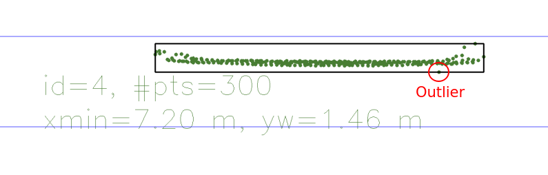
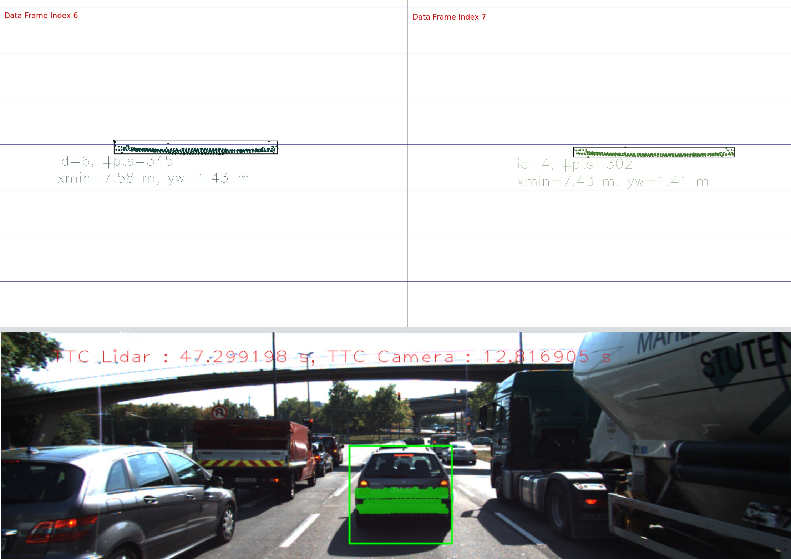
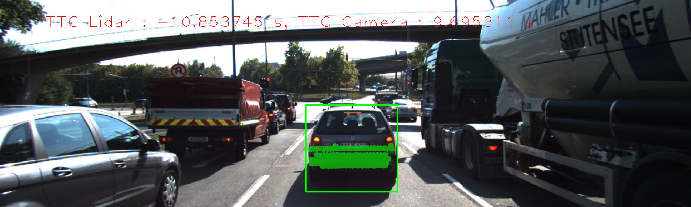
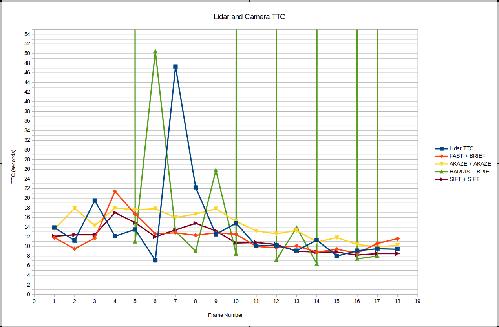

# SFND Camera Course - Final Project

This file contains documentation for the SFND camera course final project rubric points.

The specifications of the system used to build and run the program are:

- Intel® Core™ i7-8550U w/ integrated UHD 620 graphics and 16GB of RAM

- Ubuntu 20.04

- g++ 9.3

- OpenCV 4.5.1

## FP.1 Match 3D Objects

The general idea to find matching bounding boxes between successive frames is to get all the keypoints inside a specific bounding box in the current frame, then look for the bounding box in the previous frame that contains the most number of corresponding keypoint matches, as that is the most likely matching bounding box.

Below is the pseudo-code of the implementation:

```cpp
for each currBoundingBox{
    get the keypoints matches that are inside currBoundingBox's 2D ROI
    then for each prevBoundingBox {
        count the number of corresponding keypoint matches that are inside the prevBoundingBox's 2D ROI
    }
    select the prevBoundingBox with the most keypoint matches contained as the matching pair of currBoundingBox
}
```

## FP.2 Compute Lidar-based TTC

The implementation is based from the previous lesson `Estimating TTC with Lidar`.

The lidar-based TTC is computed using the constant-velocity model.

The general algorithm is to get the nearest x value in the current and previous frames to compute `delta distance`. Then the inverse of the `frameRate` is the `delta time`.

From the above, the `velocity` is computed as `delta distance / delta time`.

Finally, using the constant-velocity equation `distance = velocity * time`, `TTC` is computed as `distance / velocity`, where the `distance` used is the current frame's nearest x value.

Two implementations are available inside `computeTTCLidar()` function. One does not filter for outliers, and the other does filtering.

Filtering outlier points is done by getting the N% nearest points based on x value, and then using the median value of the sampled points as the nearest point.

This method does not give the nearest point exactly, but it assumes that the cluster of N% nearest points are close enough together such that any point in that cluster (for this case the median value) is a good representative of the nearest. Also, this filtering method assumes that outliers a very few such as in the image below wherein there is only one outlier point.



As improvement, more robust outlier filtering can be done such as clustering using point-to-point distance, and then considering clusters other than the biggest one as outliers.

## FP.3 Associate Keypoint Correspondences with Bounding Boxes

Assigning keypoints associated with bounding boxes is straightforward. Basically, if the keypoint, is inside the 2D ROI of the bounding box, that keypoint is added to the list of associated keypoints.

In `clusterKptMatchesWithROI()`, keypoint association is made more robust by...

- shrinking the 2D ROI to remove some keypoints that don't belong to the target object, such as keypoints on the road

- and by computing the average euclidean distance between current and previous frame keypoint matches, then removing keypoint matches that have a euclidean distance that is not near the average value

## FP.4 Compute Camera-based TTC

The implementation is based from the previous lesson `Estimating TTC with Camera`.

After, associating the keypoint matches to the bounding boxes in FP.3, TTC can now be computed using distances between all keypoints across successive frames.

First, all distances between keypoints in the current frame are calculated.

Then, distances between keypoints in the previous frame are also calculated.

For each corresponsing keypoint pair, the computed distance in the current frame is divided by the computed distance in the previuos frame to create a list of distance ratios.

To remove the influence of outliers, the median value of the distance ratios is used to compute for the TTC.

## FP.5 Performance Evaluation 1

### Example 1

For data frame index 6 (previous) and 7 (current), a long TTC value of `47s` was calculated using the lidar data.

Looking at the top view lidar data in the image below, it can be seen that frame 6 lidar points along the middle of the cluster is more spread out compared to other lidar data where the points are compact.

The spread-out points in frame 6 caused the distance of the nearest point to be almost the same with the distance of the nearest point in the next frame, frame 7.

This resulted in a long TTC value since it seemed that the target object did not move much. This could be because of sensor error/noise during those frames.



### Example 2

Another example, that has already been discussed in previous lessons, is that lidar TTC estimation will become incorrect, if outlier points that are much nearer than the actual nearest point of the object are not filtered out.

Since those points, are outliers, they will appear only in one frame, and not on the next one. The effect is that it will seem that the target object moved farther away causing a negative TTC value.




## FP.6 Performance Evaluation 6

### Detector + Descriptor Analysis

In order to not dilute the analysis, the detector + descriptor extractor combinations below were analyzed more in-depth than other combinations. The complete data for all combinations are listed in a latter section.

- `FAST + BRIEF`

    - From the midterm project, this combination was evaluated as the best one due to the fast execution speed and high number of detected keypoint matches, though with the trade-off of resulting in more false positives.

- `AKAZE + AKAZE`

    - This combination was selected since it had good distribution of keypoints along the edges of the target object which is expected to give more accuracy.

- `HARRIS + BRIEF`

    - `HARRIS` detector results in few detected keypoints. This combination is to show the adverse effect of having few keypoints for TTC estimation.

- `SIFT + SIFT`

    - Lastly, all the other combinations are binary descriptors, this combination is to show the performance of HOG-based descriptor.

The table and graph below shows the TTC values for the different detector + descriptor combinations, along with the lidar TTC as reference.

| Frame Number | Lidar TTC (s) | FAST + BRIEF TTC (s) | AKAZE + AKAZE TTC (s) | HARRIS + BRIEF TTC (s) | SIFT + SIFT TTC (s) |
| ------------ | ------------- | -------------------- | --------------------- | ---------------------- | ------------------- |
| 1            | 13.9          | 11.8                 | 13.6                  | nan                    | 12.1                |
| 2            | 11.2          | 9.5                  | 17.9                  | inf                    | 12.4                |
| 3            | 19.5          | 11.7                 | 14.3                  | 405.7                  | 12.4                |
| 4            | 12.1          | 21.4                 | 18                    | inf                    | 17                  |
| 5            | 13.5          | 16.7                 | 17.6                  | 11                     | 14.9                |
| 6            | 7.1           | 12.6                 | 17.8                  | 50.5                   | 12                  |
| 7            | 47.3          | 12.8                 | 16                    | 13.1                   | 13.4                |
| 8            | 22.2          | 12.3                 | 16.7                  | 9                      | 14.8                |
| 9            | 12.5          | 12.8                 | 17.8                  | 25.8                   | 13.2                |
| 10           | 14.8          | 12.5                 | 15.2                  | 8.5                    | 10.7                |
| 11           | 10.1          | 10                   | 13.2                  | inf                    | 10.8                |
| 12           | 10.2          | 9.7                  | 12.6                  | 7.2                    | 10.4                |
| 13           | 9.1           | 10.1                 | 13.3                  | 13.9                   | 9                   |
| 14           | 11.3          | 8.8                  | 10.9                  | 6.4                    | 8.8                 |
| 15           | 8             | 9.4                  | 11.8                  | inf                    | 8.8                 |
| 16           | 9.1           | 8.6                  | 10.4                  | 7.4                    | 8.2                 |
| 17           | 9.5           | 10.6                 | 9.9                   | 8                      | 8.5                 |
| 18           | 9.4           | 11.6                 | 10.2                  | nan                    | 8.5                 |



From the graph above, it can be clearly seen that the trend of all TTC estimations are all decreasing, which is expected since the ego vehicle is getting closer to the target vehicle in front.

`AKAZE + AKAZE` resulted in a trend line that didn't have large variations. This could indicate that indeed the keypoint matches are accurate for this combination.

`FAST + BRIEF` resulted in a trend line w/ larger but still acceptable variations than `AKAZE + AKAZE`. Looking back at the midterm project, this combination had the advantage of faster execution time which could be more valuable depending on the target application.

As expected `HARRIS + BRIEF` resulted in a lot of frames where TTC could not be calculated. This is due to the low number, to even possibly no keypoint matches.

The HOG-based combination of `SIFT + SIFT` resulted in a stable TTC trend line. Although really slow, detected keypoint matches are reliable resulting in good TTC estimation.

### Complete Detector + Descriptor Combinations

The tables below show the TTC(s) of all detector + descriptor combinations.

### SHITOMASI Detector TTC(s)

| Frame | SHITOMASI + BRISK | SHITOMASI + BRIEF | SHITOMASI + ORB | SHITOMASI + FREAK | SHITOMASI + SIFT |
| ----- | ----------------- | ----------------- | --------------- | ----------------- | ---------------- |
| 1     | 13.6067           | 13.9978           | 14.674          | 14.2733           | 9999             |
| 2     | 22.1341           | 13.1567           | 42.2254         | 12.3705           | 18.2012          |
| 3     | 11.3745           | 14.0403           | 13.6414         | 9.8682            | 13.6414          |
| 4     | 10.8479           | 10.6832           | 8.59737         | 10.1542           | 10.0332          |
| 5     | 10.974            | 12.1193           | 11.8506         | 11.0538           | 12.752           |
| 6     | inf               | 30.9613           | 27.2336         | 19.5434           | 30.9613          |
| 7     | 11.4341           | 11.051            | 10.7009         | 12.7461           | 10.6987          |
| 8     | 25.6044           | 10.5547           | 11.3329         | 12.38             | 31.6037          |
| 9     | 10.4565           | 11.0684           | 9.53785         | 11.2411           | 11.3409          |
| 10    | inf               | 13.3347           | 19.9188         | 12.0744           | 15.4467          |
| 11    | 8.42959           | 10.6212           | 9.47537         | 9.97025           | 10.5667          |
| 12    | 12.2541           | 10.2567           | 12.5137         | 10.3618           | 10.3529          |
| 13    | 10.1985           | 11.079            | 10.1355         | 10.2077           | 11.1935          |
| 14    | 9.02053           | 9.99744           | 14.8669         | 8.44261           | 9.99744          |
| 15    | 8.15093           | 9.96343           | 8.90539         | 8.31039           | 9.96343          |
| 16    | 9.87314           | 8.66159           | 10.4126         | 9.94982           | 10.8644          |
| 17    | 9.37913           | 11.7015           | 11.7015         | 11.9921           | 11.7015          |
| 18    | 7.71176           | 9.89432           | 9.69664         | 9.46729           | 9.89432          |


### HARRIS Detector TTC(s)

| Frame | HARRIS + BRISK | HARRIS + BRIEF | HARRIS + ORB | HARRIS + FREAK | HARRIS + SIFT |
| ----- | -------------- | -------------- | ------------ | -------------- | ------------- |
| 1     | nan            | nan            | nan          | nan            | nan           |
| 2     | inf            | inf            | inf          | inf            | inf           |
| 3     | 22.0007        | 405.717        | 22.6138      | inf            | inf           |
| 4     | inf            | inf            | inf          | inf            | inf           |
| 5     | 11.0252        | 11.0252        | 11.0252      | 11.5873        | 11.0252       |
| 6     | inf            | 50.5138        | inf          | inf            | 28.5195       |
| 7     | 10.8714        | 13.1905        | 13.1905      | 11.9596        | 13.1905       |
| 8     | 8.94716        | 9.02425        | 9.02425      | 8.756          | 9.02425       |
| 9     | 11.9747        | 25.8329        | inf          | inf            | 12.9165       |
| 10    | inf            | 8.48369        | 8.48369      | inf            | 8.48369       |
| 11    | inf            | inf            | 1056.37      | inf            | inf           |
| 12    | nan            | 7.15972        | 7.15972      | nan            | 7.68609       |
| 13    | 14.7989        | 13.9138        | 14.7989      | 11.6353        | 14.7989       |
| 14    | inf            | 6.42326        | 5.4442       | 8.87966        | 6.42326       |
| 15    | inf            | inf            | inf          | inf            | inf           |
| 16    | 6.41961        | 7.36186        | 9.02857      | 9.0661         | 7.36186       |
| 17    | 7.70129        | 8.02779        | 7.77148      | 7.53348        | 7.77148       |
| 18    | inf            | nan            | nan          | 6.63713        | 7.18368       |

### FAST Detector TTC(s)

| Frame | FAST + BRISK | FAST + BRIEF | FAST + ORB | FAST + FREAK | FAST + SIFT |
| ----- | ------------ | ------------ | ---------- | ------------ | ----------- |
| 1     | 10.8928      | 11.7874      | 10.6677    | 10.3649      | 12.266      |
| 2     | 9.93827      | 9.5377       | 10.6532    | 10.4785      | 9.97886     |
| 3     | 10.4669      | 11.6839      | 9.51069    | 9.90678      | 11.6039     |
| 4     | 11.1664      | 21.4372      | 14.2677    | 12.5001      | 14.2369     |
| 5     | 12.5721      | 16.7139      | 11.9876    | 9.69023      | 12.902      |
| 6     | 10.4391      | 12.5785      | 27.1271    | 11.7015      | 13.3673     |
| 7     | 11.2162      | 12.8169      | 15.9971    | 10.6365      | 12.4261     |
| 8     | 12.8671      | 12.2964      | 11.0928    | 10.8809      | 12.5245     |
| 9     | 11.3986      | 12.7726      | 11.4484    | 10.7615      | 12.5539     |
| 10    | 14.0892      | 12.547       | 14.6215    | 14.4813      | 12.4526     |
| 11    | 8.37031      | 10.0249      | 9.00611    | 9.59834      | 10.3155     |
| 12    | 10.1035      | 9.69531      | 13.7046    | 10.3579      | 10.7263     |
| 13    | 8.67015      | 10.1031      | 12.7005    | 8.70114      | 10.3992     |
| 14    | 8.57486      | 8.76798      | 8.52557    | 8.48457      | 9.6381      |
| 15    | 8.38239      | 9.41071      | 8.25058    | 8.50044      | 9.35898     |
| 16    | 8.02534      | 8.61247      | 8.91581    | 8.2991       | 9.30521     |
| 17    | 8.76482      | 10.5507      | 10.68      | 10.8238      | 9.6556      |
| 18    | 8.88836      | 11.6157      | 8.94736    | 8.52998      | 11.1541     |

### BRISK Detector TTC(s)

| Frame | BRISK + BRISK | BRISK + BRIEF | BRISK + ORB | BRISK + FREAK | BRISK + SIFT |
| ----- | ------------- | ------------- | ----------- | ------------- | ------------ |
| 1     | 16.0104       | 14.1416       | 18.7427     | 14.6629       | 16.0115      |
| 2     | 20.2245       | 23.1669       | 17.7278     | 20.1803       | 16.412       |
| 3     | 17.3534       | 19.1564       | 18.7662     | 17.0192       | 17.7203      |
| 4     | 15.4161       | 21.2534       | 18.0057     | 13.2154       | 14.6811      |
| 5     | 22.6255       | 17.6764       | 19.4998     | 23.7456       | 29.0693      |
| 6     | 17.3846       | 27.6456       | 20.1953     | 19.7035       | 23.4506      |
| 7     | 18.0579       | 21.6963       | 18.7623     | 15.6679       | 17.1246      |
| 8     | 20.0585       | 16.0387       | 19.1453     | 18.9947       | 18.7996      |
| 9     | 12.9184       | 20.2419       | 14.4407     | 19.6981       | 15.2714      |
| 10    | 14.5943       | 12.9135       | 13.54       | 12.1911       | 12.8916      |
| 11    | 12.8802       | 18.5714       | 13.2516     | 13.7097       | 13.6942      |
| 12    | 11.6717       | 15.9903       | 14.8781     | 12.5737       | 12.3322      |
| 13    | 11.0681       | 15.1872       | 10.7581     | 13.1337       | 11.9358      |
| 14    | 11.9074       | 13.7827       | 12.706      | 12.8969       | 12.213       |
| 15    | 14.1837       | 11.9194       | 13.6359     | 15.3406       | 11.9653      |
| 16    | 10.3347       | 13.5048       | 12.7934     | 9.05097       | 10.1636      |
| 17    | 8.13623       | 10.2138       | 8.14172     | 8.19049       | 8.59064      |
| 18    | 10.6928       | 12.3633       | 10.2523     | 9.78796       | 12.06        |

### ORB Detector TTC(s)

| Frame | ORB + BRISK | ORB + BRIEF | ORB + ORB | ORB + FREAK | ORB + SIFT |
| ----- | ----------- | ----------- | --------- | ----------- | ---------- |
| 1     | 21.3121     | -17.4825    | inf       | 10.7612     | 9.36437    |
| 2     | 25.7049     | inf         | 15.6214   | 13.1632     | 26.8893    |
| 3     | inf         | 28.581      | inf       | 29.0103     | inf        |
| 4     | 11.3196     | 9.14328     | 11.2331   | 9.60184     | 25.1615    |
| 5     | inf         | 26.8087     | inf       | inf         | inf        |
| 6     | 8.26662     | inf         | inf       | inf         | inf        |
| 7     | inf         | inf         | inf       | inf         | inf        |
| 8     | inf         | inf         | inf       | 10.0584     | 11.1051    |
| 9     | inf         | inf         | inf       | inf         | inf        |
| 10    | inf         | inf         | inf       | inf         | inf        |
| 11    | 9.50469     | 18.509      | 11.7399   | 10.7008     | 10.5839    |
| 12    | inf         | 50.716      | inf       | 8.64068     | inf        |
| 13    | 8.88415     | 12.8763     | 13.7328   | 7.39016     | 8.81218    |
| 14    | 11.6042     | 9.73275     | inf       | 8.96831     | 13.7354    |
| 15    | 17.4663     | 25.6722     | inf       | 9.10109     | 12.8636    |
| 16    | inf         | 8.44303     | inf       | 7.9497      | 13.3267    |
| 17    | 8.56995     | 9.58423     | 9.34387   | 8.434       | 10.0564    |
| 18    | 18.52       | 15.9418     | inf       | 15.2373     | 17.0851    |

### AKAZE Detector TTC(s)

| Frame | AKAZE + BRISK | AKAZE + BRIEF | AKAZE + ORB | AKAZE + FREAK | AKAZE + AKAZE | AKAZE + SIFT |
| ----- | ------------- | ------------- | ----------- | ------------- | ------------- | ------------ |
| 1     | 15.5794       | 16.9513       | 14.838      | 15.905        | 13.6013       | 14.0432      |
| 2     | 17.8368       | 17.3645       | 16.7097     | 17.6516       | 17.8798       | 17.1923      |
| 3     | 15.7197       | 15.5801       | 14.7476     | 15.4416       | 14.2556       | 14.9415      |
| 4     | 17.1167       | 16.3281       | 17.7662     | 15.7054       | 18.0411       | 18.1996      |
| 5     | 15.3791       | 16.1034       | 16.8045     | 16.3484       | 17.6229       | 17.1502      |
| 6     | 17.009        | 17.2711       | 18.2384     | 17.1636       | 17.7689       | 20.7246      |
| 7     | 16.0572       | 18.9026       | 18.4712     | 16.5339       | 16.0456       | 16.4305      |
| 8     | 15.032        | 16.5081       | 17.9567     | 17.6426       | 16.6809       | 17.4291      |
| 9     | 16.1787       | 19.1103       | 20.0506     | 20.8667       | 17.7605       | 17.2048      |
| 10    | 14.7239       | 12.6455       | 12.803      | 12.8297       | 15.1653       | 13.0293      |
| 11    | 15.0271       | 13.2679       | 14.2606     | 12.3973       | 13.2234       | 12.6063      |
| 12    | 14.0001       | 14.4848       | 12.6711     | 14.8264       | 12.5581       | 12.7923      |
| 13    | 10.9108       | 12.4534       | 12.3862     | 11.7185       | 13.2644       | 13.4175      |
| 14    | 11.3392       | 11.0991       | 10.1724     | 9.9466        | 10.9328       | 10.7915      |
| 15    | 13.8438       | 12.3461       | 10.9975     | 10.9515       | 11.7992       | 11.9679      |
| 16    | 12.5936       | 10.4667       | 9.6869      | 11.0121       | 10.3516       | 10.191       |
| 17    | 10.3613       | 10.0457       | 9.83943     | 9.84056       | 9.94089       | 10.0346      |
| 18    | 9.03722       | 9.85759       | 10.6215     | 9.30698       | 10.1987       | 9.53754      |

### SIFT Detector TTC(s)

| Frame | SIFT + BRISK | SIFT + BRIEF | SIFT + FREAK | SIFT + SIFT |
| ----- | ------------ | ------------ | ------------ | ----------- |
| 1     | 13.4733      | 14.1248      | 14.084       | 12.1169     |
| 2     | 12.5076      | 12.3376      | 13.176       | 12.4229     |
| 3     | 12.7882      | 15.089       | 14.4285      | 12.3877     |
| 4     | 20.3505      | 19.7733      | 20.3505      | 17.0566     |
| 5     | 15.976       | 18.2485      | 18.2485      | 14.8688     |
| 6     | 12.92        | 14.8879      | 13.5741      | 11.9955     |
| 7     | 13.2488      | 13.6696      | 13.9264      | 13.4283     |
| 8     | 13.7234      | 14.6966      | 13.5389      | 14.8441     |
| 9     | 13.7026      | 14.0395      | 17.4008      | 13.2307     |
| 10    | 11.3333      | 10.4821      | 10.8509      | 10.7348     |
| 11    | 10.9015      | 11.6546      | 11.809       | 10.877      |
| 12    | 10.1879      | 10.6942      | 13.701       | 10.4168     |
| 13    | 9.03127      | 9.56917      | 9.14583      | 8.95425     |
| 14    | 9.14943      | 8.86473      | 9.23228      | 8.83198     |
| 15    | 9.84244      | 9.13448      | 8.84868      | 8.78003     |
| 16    | 8.57675      | 8.62464      | 9.65778      | 8.18975     |
| 17    | 8.9245       | 8.69946      | 8.75327      | 8.52838     |
| 18    | 12.0226      | 10.5723      | 9.98912      | 8.49619     |
